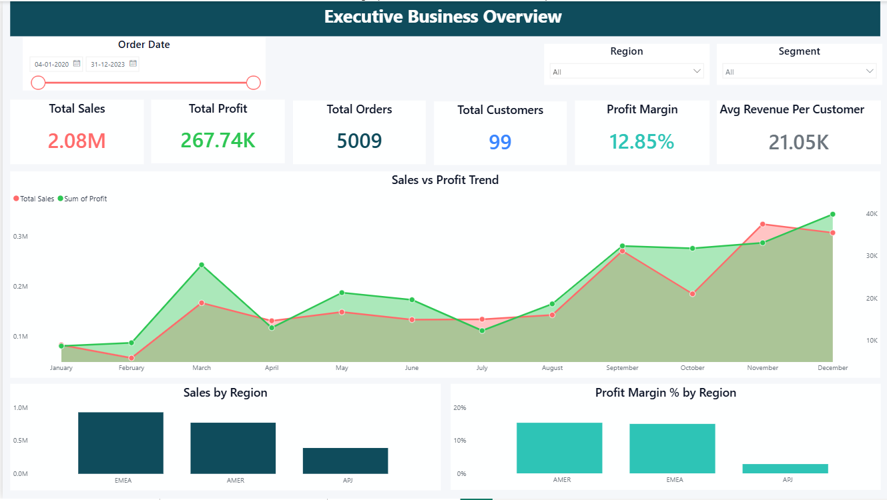
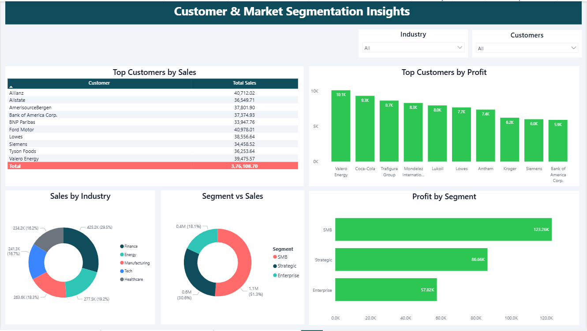
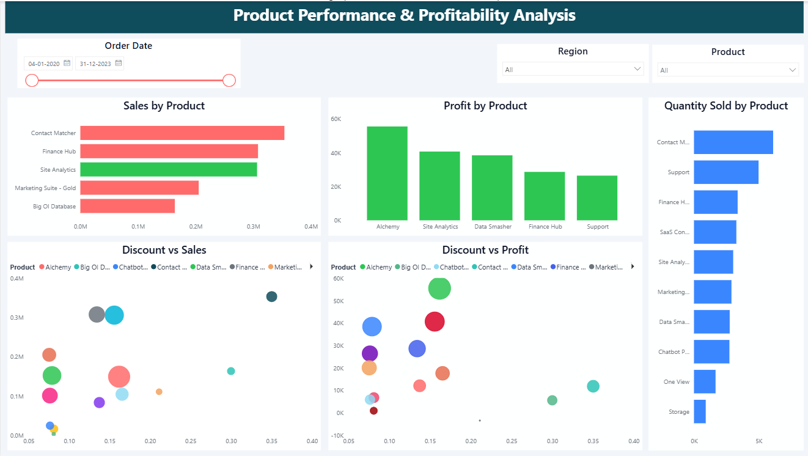

# Amazon SaaS Sales Dashboard

---

## Table of Contents

-[Project Overview](#project-overview)

-[Business Problem](#business-problem)

-[Tech Stack](#tech-stack)

-[Key Features](#key-features)

-[Dashboard Results](#dashboard-results)

-[Dataset](#dataset)

-[Project Structure](#project-structure)

-[Data Pipeline](#data-pipeline)

-[Power BI Dashboards](#power-bi-dashboards)

-[Key Insights](#key-insights)

-[Conclusion](#conclusion)

-[Future Work](#future-work)

-[Author](#author)

---

## Project Overview

This project focuses on analyzing Amazon SaaS Sales data using Power BI to uncover meaningful business insights.

The dashboard helps stakeholders to:

Monitor sales & profit performance

Understand customer behavior

Analyze product profitability

Make data-driven decisions

---

## Business Problem

SaaS companies face challenges like:

Identifying high-performing products & regions

Understanding customer segments (SMB, Enterprise)

Measuring impact of discounts on profit

Tracking sales trends over time

This dashboard solves these problems through interactive visual analysis.

---

## Tech Stack

**Excel** → Data Cleaning

**Power BI** → Dashboard & Visualization

**DAX** → KPI Calculations

---

## Key Features

Interactive dashboards with slicers (Date, Region, Segment)

KPI cards for quick performance tracking

Sales vs Profit trend analysis

Customer segmentation insights

Product-level profitability analysis

Discount impact visualization

---

## Dashboard Results

### Quick Stats from Actual Dashboards

| **Metric** | **Value** |
|-----------|----------|
| Total Sales | $2.08M |
| Total Profit | $267.74K |
| Total Orders | 5009 |
| Total Customers | 99 |
| Profit Margin | 12.85% |
| Avg Revenue per Customer | $21.05K |

---

## Dataset

The data for this project is sourced from the Kaggle dataset: [Dataset](https://www.kaggle.com/datasets/nnthanh101/aws-saas-sales)

The dataset contains:

Order Details → Order ID, Order Date

Customer Info → Customer, Customer ID, Contact Name

Location → Country, City, Region, Subregion

Business Info → Industry, Segment

Product Info → Product, License

Metrics → Sales, Quantity, Discount, Profit

---

## Project Structure

```
Amazon-SaaS-Sales-Dashboard/
│
├── Dataset/
|   ├── Amazon_SaaS_Sales.csv
├── Dashboards/
|   ├── Executive_Business_Overview.png
|   ├── Customer_and_Market_Segmentation_Insights.png
|   ├── Product_Performance_and_Profitability_Analysis.png
├── README.md
```

---

## Data Pipeline

**1: Data Collection (Amazon SaaS Dataset)**

**2: Data Cleaning in Excel**

-Removed duplicates

-Fixed formatting

-Handled missing values

**3: Data Import into Power BI**

**4: Data Modeling**

**5: DAX Calculations (KPIs)**

**6: Dashboard Development**

---

## Power BI Dashboards

### 1. Executive Business Overview


**Insights:**

Total Sales reached 2.08M

Profit margin stands at 12.85%

Sales and profit both show upward trend over time

EMEA region contributes highest sales

Average Revenue per Customer is 21.05K

---

### 2. Customer & Market Segmentation Insights


**Insights:**

SMB segment generates highest profit (123K+)

Strategic and Enterprise segments follow

Finance & Energy industries contribute major share

Top customers contribute significant revenue

Customer distribution varies across industries

---

### 3. Product Performance & Profitability Analysis


**Insights:**

Some products generate high sales but lower profit

Discount has a negative impact on profitability

Top products drive majority of revenue

Quantity sold varies significantly across products

Profitability differs across product categories

---

## Key Insights

Revenue is growing steadily, but profit growth is slower

High discounts reduce profit margins

SMB segment is the most valuable customer segment

EMEA region is the top-performing region

A few products dominate overall sales performance

---

## Conclusion

This dashboard helps the company to:

Increase profitability by controlling discounts

Focus on the most valuable customers and regions

Make better product and pricing decisions

Track performance and growth effectively

---

## Future Work

**Optimize Discounts** → Reduce unnecessary discounts to improve profit margin

**Focus on High-Value Customers (SMB)** → Increase revenue from most profitable segment

**Improve Low-Performing Regions (APJ)** → Target growth opportunities in weak markets

**Product Strategy Improvement** → Promote high-profit products and fix low-margin ones

**Sales Forecasting** → Plan future revenue and business growth more accurately

---

## Author

**Ashish Singh Kaurav**

Email:[ashishsinghkauravda@gmail.com](mailto:ashishsinghkauravda@gmail.com)

[Linkedin](https://www.linkedin.com/in/ashishsinghkauravda-analyst)

[GitHub](https://github.com/ashishsinghkauravda-analyst)

